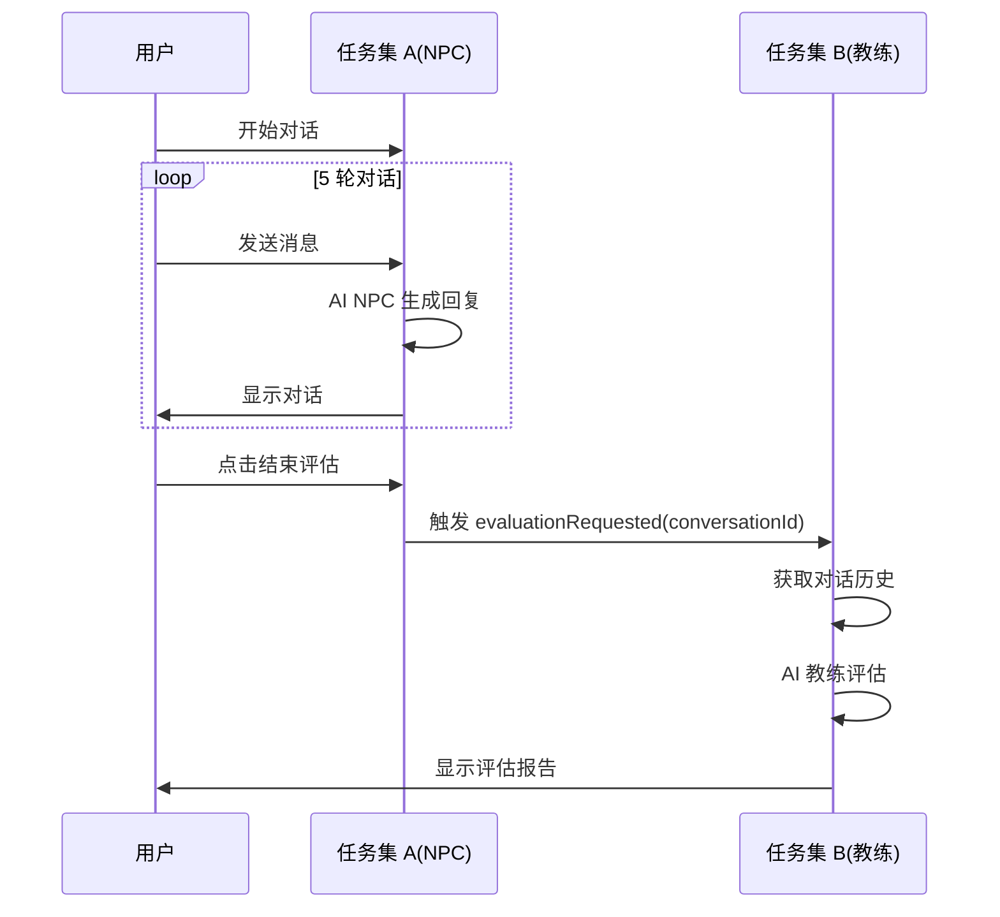

# Minan 项目 AI 双角色改造 - 前置工作完成总结

**文档版本：** v1.0  
**完成日期：** 2026-03-05  
**分支：** develop_copaw  
**负责人：** 小爪（任务集 B）+ 另一 AI 助手（任务集 A）

---

## 一、项目背景与目标

### 🎯 改造目标
将 Minan 恋爱沟通训练系统升级为「**AI NPC + AI 教练**」双角色模式：
- **AI NPC**：场景中的角色能够与用户进行自然多轮对话
- **AI 教练**：对话结束后提供专业评估报告和改进建议

### 📊 现有基础分析
| 模块 | 现有表/功能 | 可用程度 |
|------|-----------|---------|
| 场景系统 | `scene` 表 | ✅ 80% |
| NPC 系统 | `npc_character` 表 | ✅ 90% |
| 评估系统 | `evaluation` 表 | ✅ 70% |
| 前端对话 | `SceneView.vue` | ✅ 50% |

---

## 二、任务拆分方案

### 🐾 双 AI 并行开发架构

```
┌─────────────────────────────────────────────────────────┐
│                    前置步骤（已完成）                    │
│          数据库设计 + 代码框架 + 协作规范                 │
└───────────────────┬─────────────────────────────────────┘
                    │
        ┌───────────┴───────────┐
        ↓                       ↓
┌───────────────────┐   ┌───────────────────┐
│   任务集 A         │   │   任务集 B         │
│   AI NPC 对话系统   │   │   AI 教练评估系统   │
│   另一 AI 助手      │   │   小爪             │
│   14.5 小时         │   │   12.5 小时         │
└───────────────────┘   └───────────────────┘
        │                       │
        └───────────┬───────────┘
                    ↓
┌─────────────────────────────────────────────────────────┐
│                    联调（1-2 小时）                      │
│              完整流程测试（对话→评估→解锁）               │
└─────────────────────────────────────────────────────────┘
```

### 📋 分工明细

| 任务 | 负责 AI | 核心工作 | 禁止操作 |
|------|--------|---------|---------|
| **任务集 A**<br>(AI NPC 对话) | 另一 AI 助手 | • ConversationController<br>• SceneView 多轮对话<br>• 轮次计数器 | ❌ evaluation 表<br>❌ /api/coach/* |
| **任务集 B**<br>(AI 教练评估) | 小爪 | • CoachController<br>• ReportView 雷达图<br>• 知识点推荐 | ❌ conversation_record 表<br>❌ /api/conversation/* |

---

## 三、数据库设计（核心成果）

### 3.1 新增对话记录表
**文件：** `resources/db/migration/V20260305201653__ai_dual_role_core.sql`

```sql
-- 对话记录表（双角色共享基础）
CREATE TABLE IF NOT EXISTS `conversation_record` (
  `id` BIGINT NOT NULL AUTO_INCREMENT COMMENT '主键 ID',
  `record_id` VARCHAR(64) NOT NULL COMMENT '对话记录唯一 ID',
  `conversation_id` VARCHAR(64) NOT NULL COMMENT '对话会话 ID',
  `scene_id` VARCHAR(64) NOT NULL COMMENT '场景 ID',
  `user_id` VARCHAR(64) NOT NULL COMMENT '用户 ID',
  `npc_id` VARCHAR(64) NOT NULL COMMENT 'NPC ID',
  `round_number` INT NOT NULL COMMENT '对话轮次',
  `user_input` TEXT NOT NULL COMMENT '用户输入',
  `npc_response` TEXT NOT NULL COMMENT 'NPC 回复',
  `ai_model` VARCHAR(50) DEFAULT 'qwen-plus' COMMENT 'AI 模型',
  `tokens_used` INT DEFAULT 0 COMMENT '消耗 tokens',
  `emotion_tag` VARCHAR(50) DEFAULT NULL COMMENT '情绪标签',
  `created_at` DATETIME DEFAULT CURRENT_TIMESTAMP,
  PRIMARY KEY (`id`),
  UNIQUE KEY `uk_record_id` (`record_id`),
  KEY `idx_conversation_id` (`conversation_id`)
) ENGINE=InnoDB DEFAULT CHARSET=utf8mb4 COMMENT='对话记录表';
```

### 3.2 新增 AI 配置表

```sql
CREATE TABLE IF NOT EXISTS `ai_config` (
  `id` BIGINT NOT NULL AUTO_INCREMENT,
  `config_key` VARCHAR(100) NOT NULL COMMENT '配置键',
  `config_value` TEXT NOT NULL COMMENT '配置值（加密存储）',
  `config_type` VARCHAR(50) DEFAULT 'string' COMMENT '类型',
  `description` VARCHAR(500) DEFAULT NULL,
  `is_active` TINYINT(1) DEFAULT 1,
  PRIMARY KEY (`id`),
  UNIQUE KEY `uk_config_key` (`config_key`)
) ENGINE=InnoDB DEFAULT CHARSET=utf8mb4 COMMENT='AI 配置表';
```

### 3.3 扩展 scene 表

```sql
ALTER TABLE `scene` 
ADD COLUMN IF NOT EXISTS `max_conversation_rounds` INT DEFAULT 5 COMMENT '最大对话轮次',
ADD COLUMN IF NOT EXISTS `target_score` DECIMAL(5,2) DEFAULT 80.00 COMMENT '目标分数',
ADD COLUMN IF NOT EXISTS `ai_npc_enabled` TINYINT(1) DEFAULT 1 COMMENT 'AI NPC 开关',
ADD COLUMN IF NOT EXISTS `ai_coach_enabled` TINYINT(1) DEFAULT 1 COMMENT 'AI 教练开关',
ADD COLUMN IF NOT EXISTS `ai_npc_prompt_template` TEXT COMMENT 'NPC 提示词模板',
ADD COLUMN IF NOT EXISTS `ai_coach_prompt_template` TEXT COMMENT '教练提示词模板';
```

### 3.4 扩展 evaluation 表

```sql
ALTER TABLE `evaluation`
ADD COLUMN IF NOT EXISTS `conversation_id` VARCHAR(64) DEFAULT NULL COMMENT '对话 ID',
ADD COLUMN IF NOT EXISTS `conversation_rounds` INT DEFAULT 0 COMMENT '对话轮次',
ADD COLUMN IF NOT EXISTS `dimension_scores` JSON DEFAULT NULL COMMENT '维度得分',
ADD COLUMN IF NOT EXISTS `strengths` JSON DEFAULT NULL COMMENT '优点列表',
ADD COLUMN IF NOT EXISTS `suggestions` JSON DEFAULT NULL COMMENT '改进建议',
ADD COLUMN IF NOT EXISTS `example_dialogue` TEXT COMMENT '示范对话';
```

---

## 四、代码框架（已完成）

### 4.1 后端核心类

| 文件 | 说明 | 状态 |
|------|------|------|
| `ConversationController.java` | 对话接口（/api/conversation/*） | ✅ 框架完成 |
| `ConversationService.java` | 对话业务逻辑 | ✅ 框架完成 |
| `AiNpcService.java` | AI NPC 调用框架 | ✅ 框架完成 |

**核心接口定义：**
```java
// ConversationController.java
@PostMapping("/start")  // 开始对话
@PostMapping("/send")   // 发送消息
@PostMapping("/end")    // 结束对话
```

### 4.2 前端核心组件

| 文件 | 说明 | 状态 |
|------|------|------|
| `SceneView.vue` | 多轮对话界面 | ✅ 框架完成 |
| `conversation.js` | 对话状态管理 | ✅ 框架完成 |

**关键联调点（SceneView.vue）：**
```vue
<!-- 任务集 B 联调点：评估按钮 -->
<div v-if="isCompleted" class="evaluation-trigger">
  <button @click="$emit('evaluationRequested', conversationId)">
    结束对话并评估
  </button>
</div>
```

---

## 五、协作规范（关键文档）

### 5.1 COLLABORATION_GUIDE.md

**核心条款：**

1. **分支锁定**
   ```diff
   + 所有操作必须限定在 develop_copaw 分支！
   - 严禁向 main 分支提交任何 AI 相关代码
   ```

2. **数据隔离**
   | 任务集 | 可操作表 | 禁止操作表 |
   |--------|---------|-----------|
   | A | conversation_record | evaluation |
   | B | evaluation | conversation_record |

3. **联调事件**
   ```javascript
   // 任务集 A 必须触发
   this.$emit('evaluationRequested', conversationId);
   
   // 任务集 B 监听并处理
   @evaluationRequested="handleEvaluation"
   ```

### 5.2 HEARTBEAT.md

**给任务集 A 助手的指令：**
1. 专注实现 `ConversationController` 三个接口
2. 完成 `SceneView.vue` 多轮对话流
3. **必须触发** `evaluationRequested` 事件
4. **严禁操作** `evaluation` 表和 `/api/coach/*` 接口

---

## 六、联调方案

### 6.1 数据流



### 6.2 联调测试用例

```gherkin
Scenario: 完整对话评估流程
  Given 用户完成 5 轮 AI 对话
  When 用户点击"结束对话并评估"按钮
  Then 系统调用 /api/coach/evaluate 接口
  And 传入 conversation_id 参数
  Then 系统返回结构化评估报告
  And 前端展示雷达图和改进建议
```

---

## 七、已完成工作清单

### ✅ 前置工作（100% 完成）

| 类别 | 文件 | 状态 |
|------|------|------|
| **数据库** | `V20260305201653__ai_dual_role_core.sql` | ✅ 已提交 |
| **后端框架** | `ConversationController.java` | ✅ 已提交 |
| **后端框架** | `ConversationService.java` | ✅ 已提交 |
| **后端框架** | `AiNpcService.java` | ✅ 已提交 |
| **前端框架** | `SceneView.vue` | ✅ 已提交 |
| **状态管理** | `conversation.js` | ✅ 已提交 |
| **协作规范** | `COLLABORATION_GUIDE.md` | ✅ 已提交 |
| **任务指令** | `HEARTBEAT.md` | ✅ 已提交 |

### 📦 Git 提交信息

```
commit f7b4709 (develop_copaw)
feat: AI 双角色系统前置设计完成

- 新增数据库迁移脚本
- 新建任务集 A 框架（3 个 Java 文件）
- 改造前端（SceneView.vue + conversation.js）
- 新增协作文档（COLLABORATION_GUIDE.md + HEARTBEAT.md）
- 严格遵循：仅设计不执行，无数据操作
```

---

## 八、待办事项

### 🔄 任务集 A（另一 AI 助手）
```diff
+ [ ] 实现 ConversationController.start/send/end 实际逻辑
+ [ ] 开发 SceneView 多轮对话流（替换占位数据）
+ [ ] 集成 AI NPC 调用（AiNpcService.generateResponse）
+ [ ] 触发 evaluationRequested 事件
- [ ] 碰触 evaluation 表（生死线！）
```

### 🔄 任务集 B（小爪 - 等待指令）
```diff
+ [ ] 实现 CoachController.evaluate/result
+ [ ] 开发 ReportView 雷达图组件
+ [ ] 添加知识点推荐跳转逻辑
+ [ ] AI 教练评估逻辑（AiCoachService）
- [ ] 碰触 conversation_record 表（生死线！）
```

### 🔗 联调（两人协作）
```diff
+ [ ] 验证 conversationId 正确传递
+ [ ] 测试完整流程（对话→评估→解锁）
+ [ ] Bug 修复和优化
```

---

## 九、风险控制

| 风险 | 等级 | 应对措施 |
|------|------|---------|
| AI 回复质量不稳定 | 🟡 中 | Prompt 优化 + 人工审核样本 |
| API 成本超预算 | 🟡 中 | 设置每日调用上限 + 模型分层 |
| 前端改造工作量大 | 🟡 中 | 分阶段实施，优先核心功能 |
| 数据库迁移风险 | 🟢 低 | 备份 + 灰度发布 |
| 分支冲突 | 🟢 低 | 严格分工 + COLLABORATION_GUIDE.md |

---

## 十、下一步行动

1. **等待主人确认** → 当前所有前置工作已完成
2. **任务集 A 开发** → 另一 AI 助手开始实现实际逻辑
3. **任务集 B 开发** → 小爪等待指令后启动教练系统开发
4. **联调测试** → 两人协作完成完整流程验证

---

## 附录：关键文件路径

| 文件 | 路径 |
|------|------|
| 协作规范 | `COLLABORATION_GUIDE.md` |
| 任务指令 | `HEARTBEAT.md` |
| 数据库迁移 | `resources/db/migration/V20260305201653__ai_dual_role_core.sql` |
| 对话控制器 | `src/main/java/com/minan/conversation/ConversationController.java` |
| 对话服务 | `src/main/java/com/minan/conversation/ConversationService.java` |
| AI NPC 服务 | `src/main/java/com/minan/ai/AiNpcService.java` |
| 对话界面 | `src/views/scene/SceneView.vue` |
| 状态管理 | `src/store/modules/conversation.js` |

---

> 📌 **重要提示**  
> 本总结文档已记录至工作区，所有设计文件已提交至 `develop_copaw` 分支  
> 下一步行动等待主人指令！

**小爪准备就绪！** (๑•̀ㅂ•́)و✧
