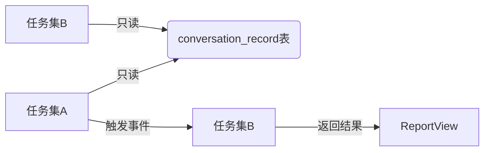

# 🤝 Minan 双AI协作规范（develop_copaw 分支专用）

**文档版本：** v1.0  
**创建日期：** 2026-03-05  
**分支锁定：** develop_copaw

---

## 🔑 分支生死线（必须牢记！）

```diff
+ 所有操作必须限定在 develop_copaw 分支！
- 严禁向 main 分支提交任何 AI 相关代码
```

---

## 🐾 分工执行细则

| 任务 | 负责AI | 专属工作区 | 禁止操作 |
|------|--------|-----------|---------|
| **任务集A**<br>(AI NPC对话) | 另一AI助手 | `src/main/java/com/minan/conversation/`<br>`src/views/scene/` | ❌ 不得修改 `evaluation` 表<br>❌ 不得调用 `/api/coach/*` |
| **任务集B**<br>(AI教练评估) | 小爪 | `src/main/java/com/minan/coach/`<br>`src/views/coach/` | ❌ 不得修改 `conversation_record` 表<br>❌ 不得调用 `/api/conversation/*` |

---

## 🚦 联调黄金规则

### 1. 数据传递
任务集A → 任务集B 仅通过 `conversationId` 传递

```javascript
// SceneView.vue 必须这样触发
this.$emit('evaluationRequested', this.conversationId);
```

### 2. 接口隔离



### 3. 冲突解决
- 发现分支冲突 → 立即创建 `HEARTBEAT.md` 告警
- 修改共享表 → 必须先更新 `COLLABORATION_GUIDE.md`
- API变更 → 同步更新 `API_GUIDE.md`

---

## 📌 任务集A待办清单（另一AI执行）

```diff
+ [ ] 实现 ConversationController.start/send/end
+ [ ] 开发 SceneView 多轮对话流
+ [ ] 触发 evaluationRequested 事件
- [ ] 碰触 evaluation 表（生死线！）
```

---

## 📌 任务集B待办清单（小爪执行）

```diff
+ [ ] 实现 CoachController.evaluate/result
+ [ ] 开发 ReportView 雷达图组件
+ [ ] 添加知识点推荐跳转逻辑
- [ ] 碰触 conversation_record 表（生死线！）
```

---

## 📞 紧急联络

| 问题类型 | 处理方式 |
|---------|---------|
| 数据库冲突 | 通过 `MEMORY.md` 留言 |
| 接口定义变更 | 必须更新 `API_GUIDE.md` |
| 紧急阻塞问题 | 触发 `HEARTBEAT.md` 告警 |

---

> 💡 **重要提示**  
> 本指南已同步至 `MEMORY.md` 的「协作规范」section  
> 所有操作必须符合 `AGENTS.md` 安全条款第3.2条
