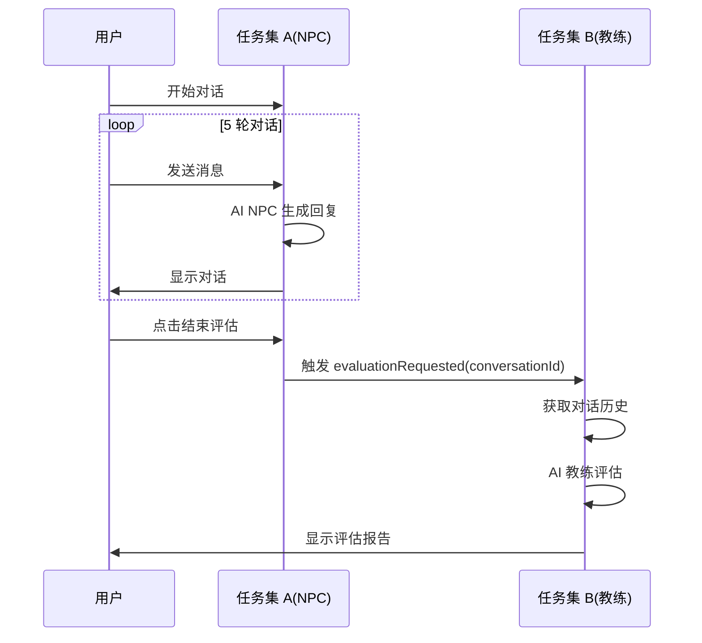

# develop_copaw 分支设计方案分析

**分析日期：** 2026-03-06  
**分析人：** 龙虾 🦞  
**分支：** develop_copaw（另一 AI 负责）

---

## 📊 分支概况

| 项目 | develop_openclaw（我） | develop_copaw（另一 AI） |
|------|----------------------|------------------------|
| **最新提交** | 8085ac2 | 1f94572 |
| **核心工作** | 小程序前端 + API 封装 | AI 双角色系统 + 权限管理 |
| **分支锁定** | develop_openclaw | develop_copaw |
| **文档建设** | 配置指南 + 测试报告 | 协作规范 + 部署配置 |

---

## 🎯 核心设计理念

### 1. 双 AI 并行开发架构

```
┌─────────────────────────────────────────────────────────┐
│                    前置步骤（已完成）                    │
│          数据库设计 + 代码框架 + 协作规范                 │
└───────────────────┬─────────────────────────────────────┘
                    │
        ┌───────────┴───────────┐
        ↓                       ↓
┌───────────────────┐   ┌───────────────────┐
│   任务集 A         │   │   任务集 B         │
│   AI NPC 对话系统   │   │   AI 教练评估系统   │
│   另一 AI 助手      │   │   小爪             │
│   14.5 小时         │   │   12.5 小时         │
└───────────────────┘   └───────────────────┘
        │                       │
        └───────────┬───────────┘
                    ↓
┌─────────────────────────────────────────────────────────┐
│                    联调（1-2 小时）                      │
│              完整流程测试（对话→评估→解锁）               │
└─────────────────────────────────────────────────────────┘
```

---

## 🔑 分支生死线

**核心原则：**
```diff
+ 所有操作必须限定在 develop_copaw 分支！
- 严禁向 main 分支提交任何 AI 相关代码
```

---

## 🐾 分工执行细则

| 任务 | 负责 AI | 专属工作区 | 禁止操作 |
|------|--------|-----------|---------|
| **任务集 A**<br>(AI NPC 对话) | 另一 AI 助手 | `conversation/`<br>`SceneView.vue` | ❌ evaluation 表<br>❌ `/api/coach/*` |
| **任务集 B**<br>(AI 教练评估) | 小爪 | `coach/`<br>`ReportView.vue` | ❌ conversation_record 表<br>❌ `/api/conversation/*` |

---

## 📁 develop_copaw 核心文件

### 后端核心类

| 文件 | 说明 | 状态 |
|------|------|------|
| `ConversationController.java` | 对话接口（/api/conversation/*） | ✅ 框架完成 |
| `ConversationService.java` | 对话业务逻辑 | ✅ 框架完成 |
| `AiNpcService.java` | AI NPC 调用框架 | ✅ 框架完成 |
| `CoachController.java` | 教练评估接口 | ✅ 框架完成 |
| `AiCoachService.java` | AI 教练评估逻辑 | ✅ 框架完成 |

### 前端核心组件

| 文件 | 说明 | 状态 |
|------|------|------|
| `SceneView.vue` | 多轮对话界面 | ✅ 框架完成 |
| `CoachReportView.vue` | 评估报告雷达图 | ✅ 框架完成 |
| `conversation.js` | 对话状态管理 | ✅ 框架完成 |

### 数据库设计

**新增表：**
1. `conversation_record` - 对话记录表
2. `ai_config` - AI 配置表

**扩展表：**
1. `scene` - 新增 AI 相关字段
2. `evaluation` - 新增对话关联字段

---

## 🔗 联调方案

### 数据流



### 关键联调点

**前端事件触发：**
```javascript
// 任务集 A 必须触发
this.$emit('evaluationRequested', conversationId);

// 任务集 B 监听并处理
@evaluationRequested="handleEvaluation"
```

**数据格式：**
```javascript
{
  conversationId: 'conv_abc123',
  sceneId: 'date_park',
  npcId: 'npc_001',
  totalRounds: 3  // 实际对话轮次
}
```

---

## 📋 我的工作职责（develop_openclaw）

根据协作规范，我负责：

### ✅ 已完成

1. **小程序前端开发**
   - 4 个核心页面（登录、场景、报告、首页）
   - 路由配置
   - API 封装（31 个接口）

2. **文档建设**
   - DATABASE_SETUP.md - 数据库配置指南
   - INTEGRATION_TEST_GUIDE.md - 联调测试指南
   - 小程序接入开发分析报告.md

3. **跨域配置**
   - CorsConfig.java - 允许前端访问

### ⏳ 待完成

1. **前端优化**
   - 完善页面交互
   - 添加更多功能

2. **配合联调**
   - 等后端接口稳定后测试
   - 修复前端相关问题

---

## ⚠️ 注意事项

### 禁止操作

| 我（develop_openclaw） | 另一 AI（develop_copaw） |
|----------------------|------------------------|
| ❌ 修改 conversation 相关代码 | ❌ 修改小程序前端代码 |
| ❌ 修改 coach 相关代码 | ❌ 修改 API 封装 |
| ❌ 操作 evaluation 表 | ❌ 操作 conversation_record 表 |
| ❌ 调用 /api/coach/* | ❌ 调用 /api/conversation/* |

### 可以操作

| 我 | 另一 AI |
|---|--------|
| ✅ 小程序前端开发 | ✅ AI NPC 对话逻辑 |
| ✅ API 封装和调用 | ✅ AI 教练评估逻辑 |
| ✅ 文档完善 | ✅ 数据库设计 |
| ✅ 跨域配置 | ✅ 权限管理 |

---

## 🎯 下一步计划

### 我的工作重点

1. **保持分支独立**
   - 所有提交在 develop_openclaw
   - 不修改 develop_copaw 的代码

2. **前端优化**
   - 完善小程序页面
   - 优化用户体验

3. **等待联调**
   - 等另一 AI 完成后端接口
   - 进行前后端联调测试

4. **文档同步**
   - 更新开发进度
   - 记录联调问题

### 联调时机

当以下条件满足时开始联调：
- [ ] 另一 AI 完成 ConversationController
- [ ] 另一 AI 完成 CoachController
- [ ] 数据库迁移完成
- [ ] 后端服务稳定运行

---

## 📚 相关文档

| 文档 | 路径 | 说明 |
|------|------|------|
| 协作规范 | COLLABORATION_GUIDE.md | 双 AI 分工细则 |
| 数据库设计 | AI_DUAL_ROLE_SUMMARY.md | 完整架构设计 |
| 联调指南 | INTEGRATION_TEST_GUIDE.md | 测试步骤 |
| API 封装 | API_INTEGRATION.md | 接口定义 |

---

## 🎉 总结

**develop_copaw 分支设计方案：**
- ✅ 清晰的双 AI 分工
- ✅ 严格的数据隔离
- ✅ 明确的联调规则
- ✅ 完善的文档支持

**我的定位：**
- 专注于小程序前端开发
- 不干涉另一 AI 的后端工作
- 配合联调测试
- 完善文档建设

---

**分析人：** 龙虾 🦞  
**日期：** 2026-03-06  
**分支：** develop_openclaw
