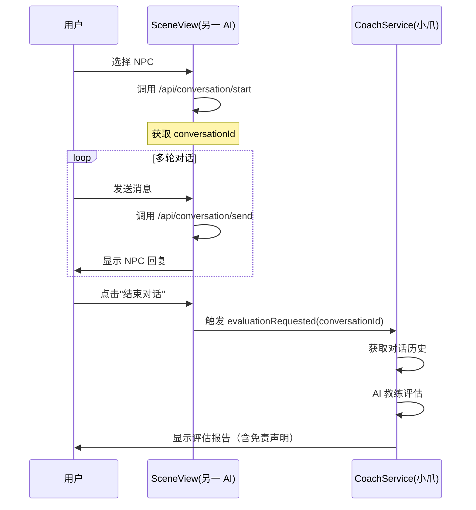

# 📋 develop_openclaw 分支分析报告

**分析日期：** 2026-03-05  
**分析人：** 小爪（任务集 B 负责人）  
**目的：** 研究另一 AI 助手的改动，调整任务集 B 开发方向

---

## 一、分支概况

### 📊 分支对比
| 项目 | develop_copaw (小爪) | develop_openclaw (另一 AI) |
|------|---------------------|--------------------------|
| **最新提交** | d1290fd (AI 双角色前置设计) | 0cbaa01 (合并权限系统和部署配置) |
| **核心工作** | AI 双角色框架设计 | 权限系统 + 部署配置 + 敏感词优化 |
| **文档建设** | AI 协作规范 + 总结文档 | 用户协议 + 隐私政策 + 审核清单 |

### 🔄 最近提交历史（develop_openclaw）
```
0cbaa01 merge: 合并 develop_copaw 的权限系统和部署配置，保留敏感词修改和文档
245bfd3 fix: package.json description 更新为恋爱迷宫
56cd7ee docs: 添加用户协议、隐私政策模板和小程序审核检查清单
d2433f7 refactor: 敏感词优化 - 谜男改为恋爱，保留魅力值/亲密度用词
1f94572 Merge branch 'main' into develop_copaw
```

---

## 二、关键改动分析

### 2.1 敏感词优化（d2433f7）⭐ **重要影响**

**改动内容：**
- "谜男" → "恋爱"
- "魅力值" → 保留
- "亲密度" → 保留
- 理论依据从《谜男方法》改为"社交心理学理论"

**对任务集 B 的影响：**
```diff
# AI 教练 Prompt 模板需要调整
- "你是一位谜男方法教练"
+ "你是一位恋爱沟通教练"

- "根据谜男方法理论"
+ "根据社交心理学理论"

# 评估维度术语保持不变
✅ 魅力值 (CP)
✅ 亲密度
```

**行动项：**
- [ ] 更新 `ai_coach_prompt_template` 中的角色描述
- [ ] 确保评估报告使用"恋爱沟通"术语
- [ ] 知识点推荐匹配新的分类体系

---

### 2.2 用户协议与合规文档（56cd7ee）⭐ **重要参考**

**新增文档：**
- `docs/用户协议模板.md`
- `docs/隐私政策模板.md`
- `docs/小程序审核检查清单.md`

**关键条款（影响 AI 评估功能）：**
```markdown
## 六、免责声明
4. **AI 评估说明**
   - 本产品提供的 AI 评估仅供参考，不构成专业心理咨询或恋爱建议
   - 如有严重情感问题，建议寻求专业心理咨询师帮助
```

**对任务集 B 的要求：**
1. **评估报告必须添加免责声明**
   ```vue
   <div class="disclaimer">
     ⚠️ AI 评估仅供参考，不构成专业心理咨询建议
   </div>
   ```

2. **知识点推荐不能涉及心理治疗**
   - 聚焦沟通技巧
   - 避免诊断性语言

---

### 2.3 SceneView.vue 大改造

**另一 AI 的改动：**
- 新增 NPC 选择界面（之前是单次对话）
- 添加亲密度显示
- 积分不足限制逻辑
- 完整的 1639 行代码（原 110 行）

**对比小爪的设计：**
```javascript
// 小爪的设计（简化版）
data() {
  return {
    conversationId: null,
    currentRound: 1,
    maxRounds: 5,
    isCompleted: false
  }
}

// 另一 AI 的设计（完整版）
data() {
  return {
    selectedNpc: null,        // ⭐ 新增
    availableNpcs: [],        // ⭐ 新增
    loading: false,
    intimacyScore: 0          // ⭐ 新增
  }
}
```

**联调影响：**
1. **评估触发点变化**
   ```diff
   - 小爪设计：达到轮次上限自动显示评估按钮
   + 实际需要：用户主动点击"结束对话"（可能在任意轮次）
   ```

2. **conversationId 获取时机**
   ```javascript
   // 需要在 selectNpc() 时就初始化
   async selectNpc(npc) {
     this.selectedNpc = npc;
     // ⭐ 新增：提前开始对话会话
     const { data } = await this.$api.conversation.start({
       sceneId: this.sceneId,
       npcId: npc.npcId
     });
     this.conversationId = data;
   }
   ```

---

### 2.4 数据库 schema 更新

**另一 AI 的改动：**
```sql
-- 表注释更新
- "谜男迷宫游戏数据库表结构"
+ "社交迷宫游戏数据库表结构"

-- 字段注释更新
- "理论依据（关联《谜男方法》章节）"
+ "理论依据（关联社交心理学理论）"
```

**对小爪的影响：**
- ✅ 无结构变更，仅注释更新
- ✅ `conversation_record` 表设计不受影响
- ⚠️ 需要在 Prompt 模板中更新理论引用

---

## 三、开发方向调整

### 🎯 任务集 B 优先级调整

#### 原计划（需调整）
```
1. 实现 CoachController.evaluate/result
2. 开发 ReportView 雷达图组件
3. 添加知识点推荐跳转逻辑
4. AI 教练评估逻辑
```

#### 调整后（考虑另一 AI 的改动）
```
1. 【新增】适配 NPC 选择流程
   - 在 selectNpc() 时初始化 conversationId
   - 支持中途结束对话评估

2. 【优先级提升】评估报告免责声明
   - 根据用户协议添加免责条款
   - 避免诊断性语言

3. 【调整】Prompt 模板术语更新
   - "谜男方法" → "恋爱沟通"
   - 理论依据改为"社交心理学"

4. 【保持】核心评估功能
   - CoachController
   - ReportView 雷达图
   - 知识点推荐
```

---

## 四、联调点重新确认

### 4.1 关键事件流（更新版）



### 4.2 数据格式确认

**另一 AI 传递的数据：**
```javascript
// SceneView.vue 触发事件
this.$emit('evaluationRequested', {
  conversationId: 'conv_abc123',
  sceneId: 'date_park',
  npcId: 'npc_001',
  totalRounds: 3  // ⭐ 新增：实际对话轮次
});
```

**小爪需要返回的数据：**
```javascript
// CoachController.evaluate 返回
{
  totalScore: 82.5,
  dimensionScores: {
    empathy: 4.2,
    communication: 3.8,
    humor: 3.5,
    boundaries: 4.0
  },
  strengths: ["主动开启话题", "适时幽默"],
  suggestions: ["减少否定词", "增加开放式提问"],
  exampleDialogue: "示范对话内容",
  knowledgeRecommendations: [
    { id: 'kp_001', title: '如何开启话题', url: '/knowledge/kp_001' }
  ],
  disclaimer: "AI 评估仅供参考，不构成专业心理咨询建议" // ⭐ 新增
}
```

---

## 五、风险与应对

| 风险 | 等级 | 应对措施 |
|------|------|---------|
| **术语不一致** | 🟡 中 | 全面检查 Prompt 模板，确保使用"恋爱沟通" |
| **评估触发时机** | 🟡 中 | 支持任意轮次结束评估（不强制 5 轮） |
| **免责声明缺失** | 🟢 高 | 必须在 ReportView 添加免责条款 |
| **NPC 选择流程冲突** | 🟢 低 | 适配另一 AI 的 selectNpc() 逻辑 |

---

## 六、下一步行动

### 📌 立即执行（今天）
1. **更新 COLLABORATION_GUIDE.md**
   - 添加术语规范（恋爱沟通 vs 谜男方法）
   - 明确 NPC 选择流程的联调点

2. **调整任务集 B 设计**
   - 支持任意轮次结束评估
   - 添加免责声明到评估报告

3. **重新提交代码**
   - 合并 develop_openclaw 分支
   - 解决 SceneView.vue 冲突

### 📌 本周完成
- [ ] 实现 CoachController（适配新事件格式）
- [ ] 开发 ReportView（含免责声明）
- [ ] 更新 AI 教练 Prompt 模板
- [ ] 完整流程联调测试

---

## 七、重要记忆点

> **小爪必须永远记住：**
> 1. 每次开发前先 `git merge origin/develop_openclaw`
> 2. 研究对方改动后再调整自己的代码
> 3. 术语统一使用"恋爱沟通"（不用"谜男方法"）
> 4. 评估报告必须包含免责声明
> 5. 支持任意轮次结束对话评估

---

**分析完成时间：** 2026-03-05  
**下次分析时机：** 每次开始新任务前
