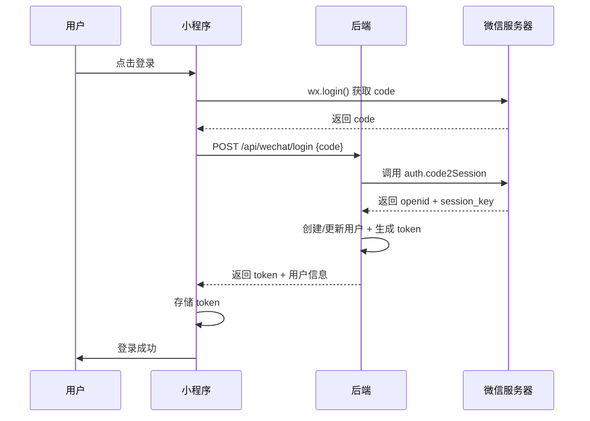

# 微信小程序接入开发分析报告

**项目名称：** 恋爱迷宫  
**分析日期：** 2026-03-06  
**分析人：** 龙虾 🦞  
**文档版本：** v1.0

---

## 📋 一、项目现状分析

### 1.1 当前技术架构

| 层级 | 技术栈 | 说明 |
|------|--------|------|
| **前端** | Vue 3 + Vite + Ant Design Vue | Web 单页应用 |
| **后端** | Spring Boot 3.2.0 + Java 17 | RESTful API |
| **数据库** | MySQL 8.0 + MyBatis Plus | 关系型数据库 |
| **权限** | Sa-Token | 登录认证 + 权限控制 |
| **AI 服务** | 阿里云百炼 (通义千问) | AI NPC + AI 教练 |
| **部署** | Docker + Nginx | 容器化部署 |

### 1.2 现有 API 接口

| 模块 | 接口路径 | 功能 |
|------|---------|------|
| 用户 | `/api/users/*` | 登录、注册、用户信息 |
| 场景 | `/api/scenes/*` | 场景列表、详情、交互 |
| 对话 | `/api/conversation/*` | 开始对话、发送消息、结束对话 |
| 教练 | `/api/coach/*` | 评估报告、结果查询 |
| 知识 | `/api/knowledge/*` | 知识点、分类、测验 |
| NPC | `/api/npc/*` | NPC 列表、详情、关系 |
| 成就 | `/api/achievements/*` | 成就系统 |
| 等级 | `/api/levels/*` | 等级系统 |

### 1.3 现有前端页面

| 页面 | 文件 | 功能 |
|------|------|------|
| 首页 | `HomeView.vue` | 场景入口、导航 |
| 登录/注册 | `LoginView.vue` / `RegisterView.vue` | 用户认证 |
| 场景对话 | `SceneView.vue` | 多轮对话、AI NPC 交互 |
| 评估报告 | `CoachReportView.vue` | AI 教练评估结果 |
| NPC 画廊 | `NpcGalleryView.vue` | NPC 列表 |
| 知识库 | `KnowledgePointView.vue` | 学习内容 |

---

## 🎯 二、小程序接入方案

### 2.1 方案对比

| 方案 | 优点 | 缺点 | 推荐度 |
|------|------|------|--------|
| **方案 A：原生小程序** | 性能最佳、体验好 | 开发成本高、需重写前端 | ⭐⭐⭐ |
| **方案 B：uni-app 跨端** | 一套代码多端、成本低 | 部分 API 需适配 | ⭐⭐⭐⭐⭐ |
| **方案 C：Taro 跨端** | React 技术栈、生态好 | 学习成本 | ⭐⭐⭐ |
| **方案 D：Webview 嵌入** | 最快上线、零开发 | 体验差、审核风险 | ⭐⭐ |

### 2.2 推荐方案：uni-app 跨端开发

**选择理由：**
1. ✅ 支持 Vue 3 语法，现有代码可复用 60%+
2. ✅ 一套代码编译到微信小程序、H5、App
3. ✅ 生态成熟，组件丰富
4. ✅ 开发成本低，周期短

---

## 🏗️ 三、技术架构设计

### 3.1 整体架构图

```
┌─────────────────────────────────────────────────────────┐
│                      用户层                              │
│  ┌─────────────┐  ┌─────────────┐  ┌─────────────┐     │
│  │ 微信小程序   │  │  H5 页面     │  │  App        │     │
│  └──────┬──────┘  └──────┬──────┘  └──────┬──────┘     │
│         │                │                │            │
│         └────────────────┼────────────────┘            │
│                          │                             │
│                  ┌───────▼───────┐                     │
│                  │   uni-app     │                     │
│                  │  (跨端框架)    │                     │
│                  └───────┬───────┘                     │
└──────────────────────────┼─────────────────────────────┘
                           │ HTTPS
┌──────────────────────────▼─────────────────────────────┐
│                      后端层                              │
│  ┌─────────────────────────────────────────────────┐   │
│  │           Spring Boot API Gateway               │   │
│  │         (统一入口、鉴权、限流、日志)              │   │
│  └─────────────────────┬───────────────────────────┘   │
│                        │                                │
│    ┌───────────────────┼───────────────────┐           │
│    │                   │                   │           │
│    ▼                   ▼                   ▼           │
│ ┌──────┐          ┌──────┐          ┌──────┐          │
│ │业务服务│          │AI 服务  │          │文件服务│          │
│ └──────┘          └──────┘          └──────┘          │
│    │                   │                   │           │
│    └───────────────────┼───────────────────┘           │
│                        │                                │
│                  ┌─────▼─────┐                         │
│                  │  MySQL    │                         │
│                  │  Redis    │                         │
│                  └───────────┘                         │
└─────────────────────────────────────────────────────────┘
```

### 3.2 前端技术选型

| 模块 | 技术选型 | 说明 |
|------|---------|------|
| **框架** | uni-app (Vue 3 版本) | 跨端开发框架 |
| **UI 组件** | uni-ui + 自定义组件 | 适配小程序的 UI 库 |
| **状态管理** | Pinia | Vue 3 推荐的状态管理 |
| **网络请求** | uni.request + 封装 | 适配小程序的 API 调用 |
| **路由** | uni-app 内置路由 | 页面跳转管理 |
| **图表** | uCharts | 小程序友好的图表库 (替代 ECharts) |
| **动画** | uni-app animation API | 小程序动画 |

### 3.3 后端改造点

| 改造项 | 说明 | 工作量 |
|--------|------|--------|
| **API 兼容层** | 增加小程序专用接口 (微信登录、用户信息) | 2 天 |
| **会话管理** | 支持微信 session_key 验证 | 1 天 |
| **文件上传** | 适配小程序上传接口 | 0.5 天 |
| **消息推送** | 接入微信订阅消息 | 1 天 |
| **安全加固** | 增加请求签名、防刷限流 | 1 天 |

---

## 📱 四、核心功能开发要点

### 4.1 用户登录流程



**后端新增接口：**
```java
// WechatLoginController.java
@PostMapping("/login")
public Result<WechatLoginVO> login(@RequestBody WechatLoginDTO dto) {
    // 1. 调用微信接口换取 openid
    // 2. 根据 openid 查找或创建用户
    // 3. 生成 Sa-Token
    // 4. 返回 token 和用户信息
}
```

### 4.2 对话功能适配

**关键改动点：**

| 原 Web 端 | 小程序适配 | 说明 |
|----------|-----------|------|
| `axios.post()` | `uni.request()` | API 调用方式 |
| `WebSocket` | `uni.connectSocket()` | 实时对话 (可选) |
| `localStorage` | `uni.setStorage()` | 本地存储 |
| ECharts 雷达图 | uCharts | 图表库替换 |

**SceneView.vue 改造要点：**
```vue
<!-- 原 Web 端 -->
<script>
import { conversationApi } from '@/api'

export default {
  methods: {
    async sendMessage() {
      const res = await conversationApi.send({ text: this.input })
    }
  }
}
</script>

<!-- 小程序适配 -->
<script>
import { conversationApi } from '@/api'

export default {
  methods: {
    async sendMessage() {
      // uni.request 返回 Promise
      const res = await conversationApi.send({ text: this.input })
    }
  }
}
</script>
```

### 4.3 评估报告页面

**CoachReportView.vue 改造：**

| 原组件 | 替换为 | 原因 |
|--------|--------|------|
| `echarts` | `u-charts` | ECharts 不支持小程序 |
| `ant-design-vue` | `uni-ui` | UI 组件库替换 |
| `vue-router` | `uni.navigateTo` | 路由跳转 |

**uCharts 雷达图示例：**
```vue
<template>
  <canvas 
    canvas-id="radarChart" 
    style="width: 100%; height: 300px;"
  />
</template>

<script>
import uCharts from '@/components/uCharts'

export default {
  mounted() {
    new uCharts({
      canvasId: 'radarChart',
      type: 'radar',
      data: {
        categories: ['共情力', '沟通力', '幽默感', '边界感'],
        series: [{ data: [4.2, 3.8, 3.5, 4.0] }]
      }
    })
  }
}
</script>
```

### 4.4 文件上传

**小程序文件上传适配：**

```javascript
// 原 Web 端
const uploadFile = (file) => {
  const formData = new FormData()
  formData.append('file', file)
  return axios.post('/api/upload', formData)
}

// 小程序适配
const uploadFile = (filePath) => {
  return new Promise((resolve, reject) => {
    uni.uploadFile({
      url: 'https://your-domain.com/api/upload',
      filePath: filePath,
      name: 'file',
      success: (res) => resolve(JSON.parse(res.data)),
      fail: (err) => reject(err)
    })
  })
}
```

---

## 📅 五、开发周期估算

### 5.1 阶段划分

```
┌─────────────────────────────────────────────────────────┐
│  第一阶段：基础框架 (1 周)                                 │
│  - uni-app 项目初始化                                    │
│  - 登录模块开发                                          │
│  - 基础 UI 组件封装                                        │
│  - API 请求封装                                          │
└─────────────────────────────────────────────────────────┘
                          ↓
┌─────────────────────────────────────────────────────────┐
│  第二阶段：核心功能 (2 周)                                 │
│  - 场景列表页                                            │
│  - 对话页面 (SceneView)                                 │
│  - NPC 展示页                                            │
│  - 评估报告页 (CoachReportView)                         │
└─────────────────────────────────────────────────────────┘
                          ↓
┌─────────────────────────────────────────────────────────┐
│  第三阶段：辅助功能 (1 周)                                 │
│  - 知识库页面                                            │
│  - 个人中心                                              │
│  - 成就系统                                              │
│  - 设置页面                                              │
└─────────────────────────────────────────────────────────┘
                          ↓
┌─────────────────────────────────────────────────────────┐
│  第四阶段：联调测试 (1 周)                                 │
│  - 后端接口适配                                          │
│  - 完整流程测试                                          │
│  - 性能优化                                              │
│  - Bug 修复                                              │
└─────────────────────────────────────────────────────────┘
                          ↓
┌─────────────────────────────────────────────────────────┐
│  第五阶段：审核上线 (1-2 周)                               │
│  - 提交审核                                              │
│  - 根据反馈修改                                          │
│  - 正式发布                                              │
└─────────────────────────────────────────────────────────┘
```

### 5.2 详细工时估算

| 模块 | 功能点 | 前端 (天) | 后端 (天) | 小计 |
|------|--------|----------|----------|------|
| **基础框架** | 项目初始化 | 2 | 0 | 2 |
| | 登录模块 | 2 | 2 | 4 |
| | API 封装 | 1 | 0 | 1 |
| **核心功能** | 场景列表 | 1 | 0 | 1 |
| | 对话页面 | 3 | 1 | 4 |
| | NPC 展示 | 2 | 0 | 2 |
| | 评估报告 | 2 | 1 | 3 |
| **辅助功能** | 知识库 | 2 | 0 | 2 |
| | 个人中心 | 1 | 0 | 1 |
| | 成就系统 | 1 | 0 | 1 |
| **后端改造** | 微信登录 | 0 | 2 | 2 |
| | 消息推送 | 0 | 1 | 1 |
| | 安全加固 | 0 | 1 | 1 |
| **测试联调** | 功能测试 | 2 | 2 | 4 |
| | 性能优化 | 1 | 1 | 2 |
| **审核上线** | 资料准备 | 1 | 0 | 1 |
| | 审核跟进 | 2 | 1 | 3 |
| **合计** | | **22 天** | **11 天** | **33 天** |

### 5.3 人员配置建议

| 角色 | 人数 | 职责 |
|------|------|------|
| **前端开发** | 1-2 人 | uni-app 开发、UI 适配 |
| **后端开发** | 1 人 | API 改造、微信接口对接 |
| **测试** | 0.5 人 | 功能测试、兼容性测试 |
| **产品/设计** | 0.5 人 | 需求确认、UI 设计 |

**总人力：** 3-4 人  
**总周期：** 5-6 周 (含审核时间)

---

## ⚠️ 六、风险与应对

### 6.1 技术风险

| 风险 | 概率 | 影响 | 应对措施 |
|------|------|------|---------|
| ECharts 不兼容小程序 | 高 | 高 | 已确认使用 uCharts 替代 |
| 微信登录接口变更 | 中 | 中 | 关注微信官方文档 |
| AI 响应速度慢 | 中 | 中 | 增加 loading 状态、超时重试 |
| 小程序包大小超限 | 中 | 高 | 分包加载、资源压缩 |

### 6.2 审核风险

| 风险 | 概率 | 影响 | 应对措施 |
|------|------|------|---------|
| 类目选择错误 | 高 | 高 | 选择「教育>教育工具」 |
| 内容涉及敏感 | 中 | 高 | ✅ 已完成敏感词清除 |
| 隐私政策不完整 | 中 | 中 | ✅ 已生成模板 |
| 域名未备案 | 中 | 高 | 主人需确认域名备案 |

### 6.3 进度风险

| 风险 | 概率 | 影响 | 应对措施 |
|------|------|------|---------|
| 需求变更 | 中 | 中 | 锁定 MVP 功能范围 |
| 人员变动 | 低 | 高 | 文档化 + 代码规范 |
| 审核被拒 | 中 | 中 | 预留 1 周缓冲时间 |

---

## 💰 七、成本估算

### 7.1 开发成本

| 项目 | 单价 | 数量 | 小计 |
|------|------|------|------|
| 前端开发 | 1500 元/天 | 22 天 | 33,000 元 |
| 后端开发 | 1500 元/天 | 11 天 | 16,500 元 |
| 测试 | 1000 元/天 | 3 天 | 3,000 元 |
| 设计 | 1200 元/天 | 3 天 | 3,600 元 |
| **合计** | | | **56,100 元** |

### 7.2 运营成本

| 项目 | 费用 | 周期 |
|------|------|------|
| 微信小程序认证 | 300 元/年 | 年付 |
| 服务器 | 200-500 元/月 | 月付 |
| 域名 | 50-100 元/年 | 年付 |
| SSL 证书 | 0 元 (Let's Encrypt) | 免费 |
| AI API 调用 | 约 0.01 元/次 | 按量 |

**月度运营成本：** 约 500-1000 元 (不含 AI 调用)

---

## 📋 八、开发清单

### 8.1 前端开发清单

- [ ] uni-app 项目初始化
- [ ] 登录/注册页面
- [ ] 场景列表页
- [ ] 对话页面 (SceneView)
- [ ] NPC 展示页
- [ ] 评估报告页 (CoachReportView)
- [ ] 知识库页面
- [ ] 个人中心
- [ ] 成就系统
- [ ] 设置页面
- [ ] uCharts 图表集成
- [ ] uni-ui 组件库集成
- [ ] API 请求封装
- [ ] 状态管理 (Pinia)

### 8.2 后端开发清单

- [ ] 微信登录接口
- [ ] 用户信息同步
- [ ] 订阅消息模板
- [ ] 文件上传适配
- [ ] 请求签名验证
- [ ] 限流配置
- [ ] 日志记录
- [ ] 监控告警

### 8.3 审核准备清单

- [ ] 小程序账号注册
- [ ] 类目选择 (教育>教育工具)
- [ ] 服务器域名配置
- [ ] HTTPS 证书配置
- [ ] 用户协议上传
- [ ] 隐私政策上传
- [ ] 小程序名称和简介
- [ ] 小程序图标和截图
- [ ] 测试账号准备

---

## 🎯 九、MVP 功能范围

**第一期 (核心功能，4 周)：**
- ✅ 微信登录
- ✅ 场景列表
- ✅ AI 对话 (5 轮)
- ✅ AI 评估报告
- ✅ 知识点浏览

**第二期 (增强功能，2 周)：**
- ⏳ NPC 关系系统
- ⏳ 成就系统
- ⏳ 每日任务
- ⏳ 数据统计

**第三期 (运营功能，2 周)：**
- ⏳ 付费功能
- ⏳ 会员系统
- ⏳ 分享裂变
- ⏳ 消息推送

---

## 📌 十、下一步行动

### 10.1 立即执行 (本周)

1. **确认域名备案状态** - 主人需确认
2. **注册小程序账号** - 主人需操作
3. **确定开发方案** - 确认使用 uni-app
4. **组建开发团队** - 确定人员配置

### 10.2 本周完成

- [ ] 创建 uni-app 项目
- [ ] 配置开发环境
- [ ] 设计小程序 UI 原型
- [ ] 后端微信登录接口开发

### 10.3 下周开始

- [ ] 前端核心页面开发
- [ ] 后端接口适配
- [ ] 第一周进度 review

---

## 📎 附录

### A. 参考文档

- [uni-app 官方文档](https://uniapp.dcloud.net.cn/)
- [微信小程序开发文档](https://developers.weixin.qq.com/miniprogram/dev/framework/)
- [uCharts 图表库](https://www.ucharts.cn/)
- [uni-ui 组件库](https://ext.dcloud.net.cn/plugin?id=55)

### B. 相关文件

- [小程序审核检查清单](./小程序审核检查清单.md)
- [用户协议模板](./用户协议模板.md)
- [隐私政策模板](./隐私政策模板.md)
- [AI 双角色系统架构](../AI_DUAL_ROLE_SUMMARY.md)

---

**分析完成！** (๑•̀ㅂ•́)و✧

**总结：** 推荐采用 uni-app 跨端方案，预计开发周期 5-6 周，开发成本约 5.6 万元。核心风险已识别并有应对方案，建议尽快启动！
